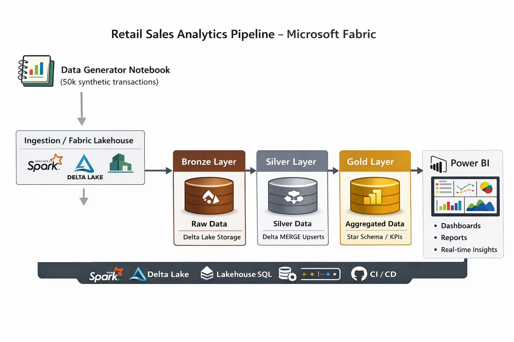
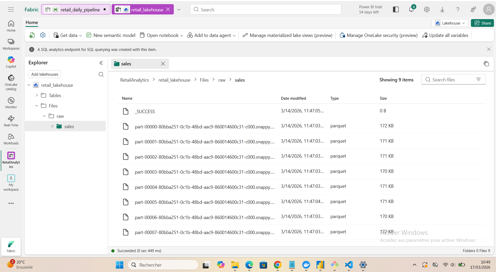
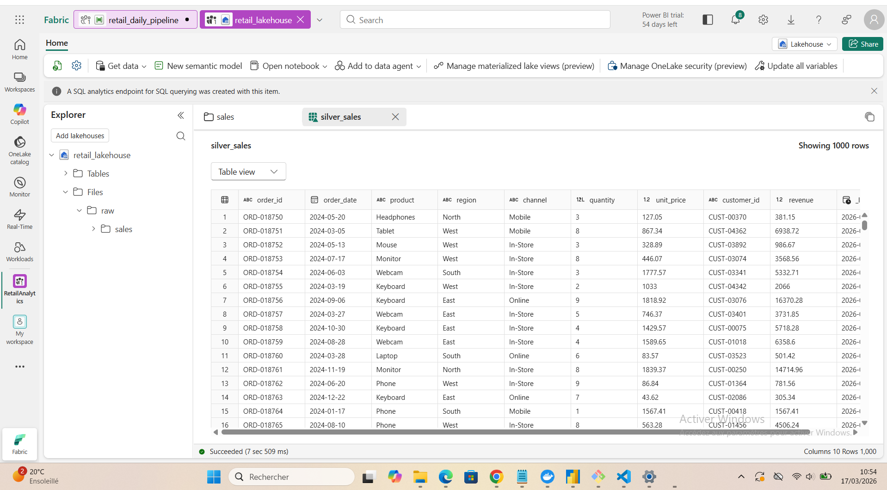
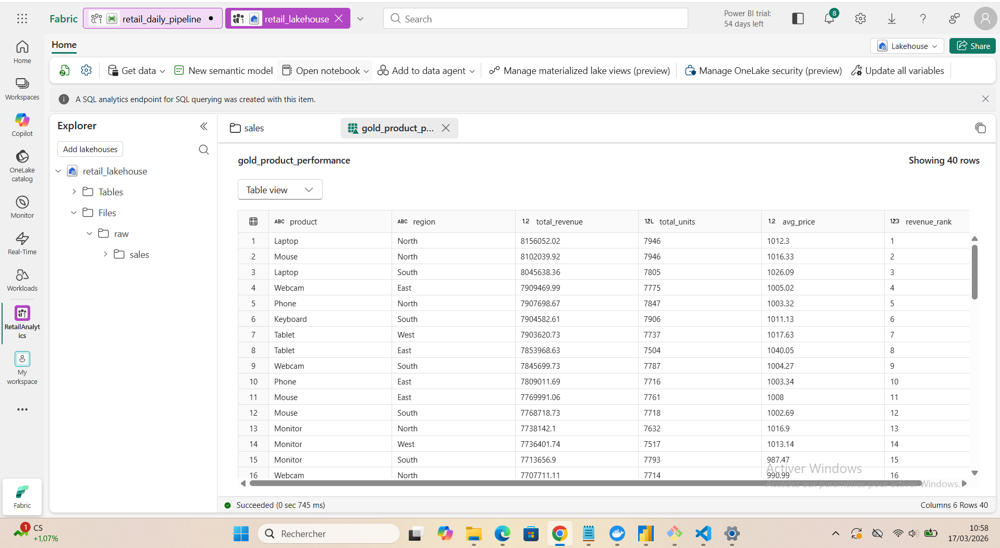
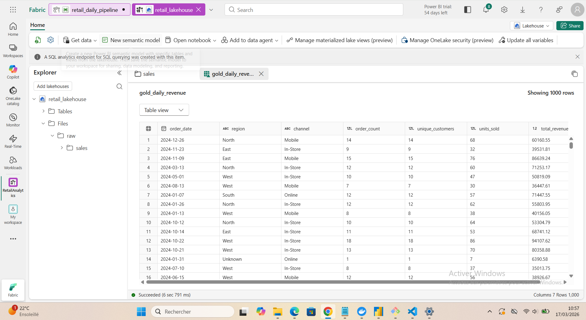
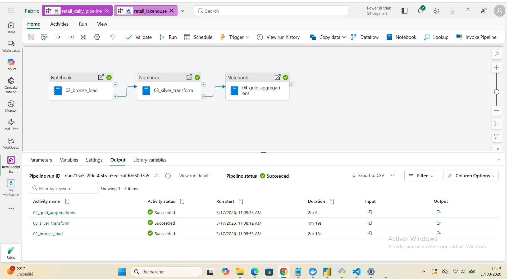
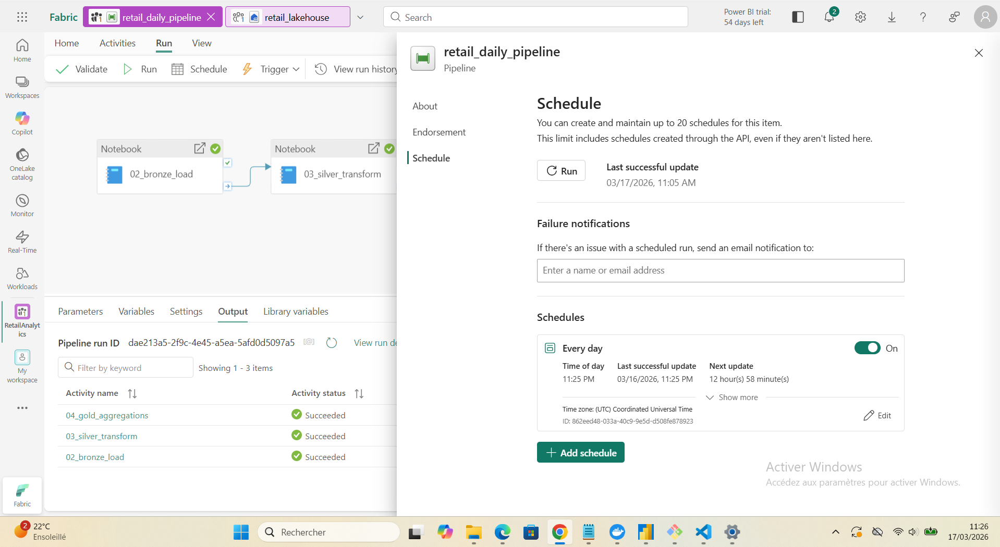
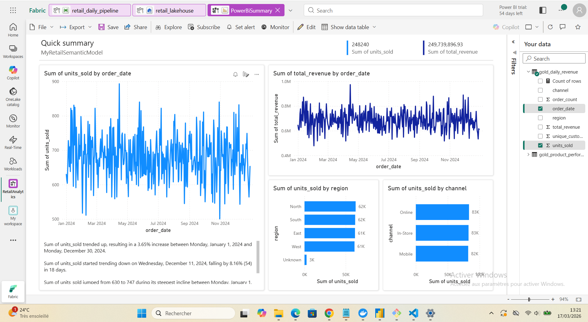

# Retail Sales Analytics Pipeline — Microsoft Fabric

Description
This project is a production-grade, end-to-end data engineering pipeline built entirely
on Microsoft Fabric. It models a retail company's sales analytics platform — ingesting raw
transaction data, transforming it through a medallion lakehouse architecture (Bronze → Silver
→ Gold), and serving business-ready metrics to Power BI via DirectLake.
The pipeline processes 50,000 synthetic retail orders spanning 8 product categories,
4 sales regions, and 3 channels (Online, In-Store, Mobile) across a full calendar year.
Intentional data quality issues — null regions, negative unit prices — are baked into the
source to make the cleansing and validation logic realistic and meaningful.
Every engineering decision mirrors what you would find in a production data platform at scale:
idempotent MERGE upserts, schema evolution handling, Delta file optimisation for BI performance,
orchestrated retry-capable pipelines, and a full Git-based CI/CD workflow with feature branches
and pull requests.
This project demonstrates:

Medallion lakehouse design (Bronze / Silver / Gold) on OneLake with Delta Parquet
PySpark data quality enforcement and Delta MERGE (SCD Type 1 upsert pattern)
Data Factory pipeline orchestration with daily scheduling and failure alerting
Power BI DirectLake semantic model — no data import, no DirectQuery overhead
Version-controlled Fabric workspace via GitHub Git integration


---

## Architecture overview



**Medallion layers**

| Layer  | Table                    | Description                                      |
|--------|--------------------------|--------------------------------------------------|
| Bronze | `bronze_sales`           | Raw data landed as-is, schema-on-read, no edits  |
| Silver | `silver_sales`           | Cleansed, typed, null-filled, MERGE upsert       |
| Gold   | `gold_daily_revenue`     | Daily revenue aggregated by region & channel     |
| Gold   | `gold_product_performance` | Product rankings, units sold, average price    |

---

## Tech stack

| Layer           | Technology                                      |
|-----------------|-------------------------------------------------|
| Platform        | Microsoft Fabric (Trial / F64+)                 |
| Storage         | OneLake — Delta Parquet (single copy)           |
| Processing      | Apache Spark 3.x via Fabric Notebooks (PySpark) |
| Table format    | Delta Lake — MERGE, OPTIMIZE, time travel       |
| Orchestration   | Data Factory Pipelines — daily schedule         |
| Serving         | Lakehouse SQL endpoint + Power BI DirectLake    |
| CI/CD           | GitHub via Fabric Git integration               |
| Quality         | Row count checks, null enforcement, range rules |

---

## Repository structure

```
fabric-retail-pipeline/
├── .fabric/
│   └── workspace                        # Fabric workspace metadata
├── retail_lakehouse.Lakehouse/
│   └── .platform                        # Lakehouse definition
├── 01_generate_data.Notebook/
│   ├── notebook-content.ipynb           # Synthetic data generation (50k rows)
│   └── .platform
├── 02_bronze_load.Notebook/
│   ├── notebook-content.ipynb           # Raw Parquet → Bronze Delta table
│   └── .platform
├── 03_silver_transform.Notebook/
│   ├── notebook-content.ipynb           # Cleanse + Delta MERGE upsert
│   └── .platform
├── 04_gold_aggregations.Notebook/
│   ├── notebook-content.ipynb           # Gold aggregations + OPTIMIZE
│   └── .platform
├── retail_daily_pipeline.DataPipeline/
│   ├── pipeline-content.json            # Orchestration graph (JSON)
│   └── .platform
└── README.md
```

---

## Pipeline walkthrough

### Step 1 — Generate synthetic source data

Simulates a realistic retail source: 50,000 orders, 8 product categories, 4 regions,
3 sales channels. Intentional quality issues are introduced (null regions, negative
prices) to make the Silver cleansing step meaningful.

```python
spark_df = spark.createDataFrame(df)
spark_df.write.mode('overwrite').parquet('Files/raw/sales/')
```


### Step 2 — Bronze load (raw zone)

Reads raw Parquet files and lands them as a Delta table with no transformations.
`mergeSchema=true` handles upstream schema evolution automatically.

```python
df_raw = spark.read.parquet('Files/raw/sales/')

df_raw.write \
    .format('delta') \
    .mode('overwrite') \
    .option('mergeSchema', 'true') \
    .saveAsTable('bronze_sales')
```

**Why Bronze matters:** It is the recovery point. If Silver logic breaks, you re-run
from Bronze — you never re-pull from the source system.

### Step 3 — Silver transform (cleanse + upsert)

Applies data quality rules and writes via Delta MERGE — making every pipeline run
idempotent (safe to re-run with no duplicates).

```python
from delta.tables import DeltaTable
from pyspark.sql import functions as F

df_clean = (df_bronze
    .filter(F.col('unit_price') > 0)           # drop negative prices
    .withColumn('region',
        F.when(F.col('region').isNull(), 'Unknown').otherwise(F.col('region')))
    .withColumn('order_date', F.to_date('order_date'))
    .withColumn('revenue', F.round(F.col('quantity') * F.col('unit_price'), 2))
    .withColumn('_loaded_at', F.current_timestamp())
)

DeltaTable.forName(spark, 'silver_sales') \
    .alias('t') \
    .merge(df_clean.alias('s'), 't.order_id = s.order_id') \
    .whenMatchedUpdateAll() \
    .whenNotMatchedInsertAll() \
    .execute()
```

**Quality rules applied:**
- Drop rows where `unit_price <= 0`
- Fill null `region` → `'Unknown'`
- Cast `order_date` to `DateType`
- Recompute `revenue = quantity × unit_price`
- Stamp `_loaded_at` audit column



### Step 4 — Gold aggregations (BI-ready)

Pre-computes business metrics and optimises Delta files for Power BI DirectLake.

```sql
-- Daily revenue by region & channel
CREATE OR REPLACE TABLE gold_daily_revenue AS
SELECT
    order_date,
    region,
    channel,
    COUNT(DISTINCT order_id)    AS order_count,
    COUNT(DISTINCT customer_id) AS unique_customers,
    SUM(quantity)               AS units_sold,
    ROUND(SUM(revenue), 2)      AS total_revenue
FROM silver_sales
GROUP BY order_date, region, channel;

OPTIMIZE gold_daily_revenue;
OPTIMIZE gold_product_performance;

CREATE OR REPLACE TABLE gold_product_performance AS
SELECT
    product,
    region,
    ROUND(SUM(revenue), 2)          AS total_revenue,
    SUM(quantity)                    AS total_units,
    ROUND(AVG(unit_price), 2)        AS avg_price,
    RANK() OVER (ORDER BY SUM(revenue) DESC) AS revenue_rank
FROM silver_sales
GROUP BY product, region
```
`OPTIMIZE` compacts small Delta files into larger ones — critical for DirectLake
read performance.



### Step 5 — Orchestration

A Data Factory pipeline chains all three notebooks with success dependencies and
runs on a daily schedule at 06:00 UTC. Email alerts fire on any activity failure.

```
bronze_load  ──(success)──▶  silver_transform  ──(success)──▶  gold_aggregations
```



### Step 6 — Power BI DirectLake

A semantic model is created directly from the Lakehouse SQL endpoint. Power BI
reads Delta files at Spark scale without importing or duplicating data.



**DirectLake vs alternatives:**

| Mode        | Data copy | Refresh needed | Scale   |
|-------------|-----------|----------------|---------|
| Import      | Yes       | Yes            | Limited |
| DirectQuery | No        | No             | Slow    |
| DirectLake  | No        | No             | Spark   |

---

## Key engineering patterns

### Idempotent MERGE upsert
Every Silver run uses `MERGE INTO` — the pipeline can fire multiple times without
producing duplicates. This is a production requirement, not an optimisation.

### Schema evolution
`mergeSchema=true` on Bronze writes means new columns from the source are
automatically absorbed without pipeline failures.

### Delta time travel
```sql
-- Audit: what did silver_sales look like 2 days ago?
SELECT * FROM silver_sales VERSION AS OF 3;
SELECT * FROM silver_sales TIMESTAMP AS OF '2024-06-01';
```

### Git-based CI/CD
The workspace is connected to this GitHub repository via Fabric Git integration.
Each Fabric item (notebook, pipeline, lakehouse) is serialised to version-controlled
files. Feature development follows a branch-and-PR workflow:

```
main ◀── PR ◀── feature/add-customer-segmentation
```

---

## Running this project

### Prerequisites
- Microsoft Fabric workspace (Trial or paid capacity)
- GitHub account

### Setup
1. Fork this repository
2. In your Fabric workspace → Workspace settings → Git integration → connect to your fork
3. Sync — all notebooks and pipeline definitions will appear in your workspace
4. Open `01_generate_data` notebook and click **Run All**
5. Run notebooks `02`, `03`, `04` in order — or trigger `retail_daily_pipeline`
6. Create a new semantic model from the Lakehouse → build your Power BI report

---

## What I would add at production scale

| Concern | Approach |
|---------|----------|
| Partitioning | Partition Silver and Gold by `order_date` for partition pruning |
| Liquid clustering | Replace static partitioning with Delta liquid clustering on `region` + `channel` |
| Data contracts | Add Great Expectations or dbt tests at Silver boundary |
| Dev / prod separation | Separate Fabric workspaces + deployment pipeline for promotion |
| Monitoring | Capacity Metrics App + custom logging table for pipeline run history |
| PII handling | Column-level encryption + Purview data classification on `customer_id` |

---

## Author

Built as a portfolio project demonstrating end-to-end data engineering on Microsoft Fabric.
Feedback and PRs welcome.
